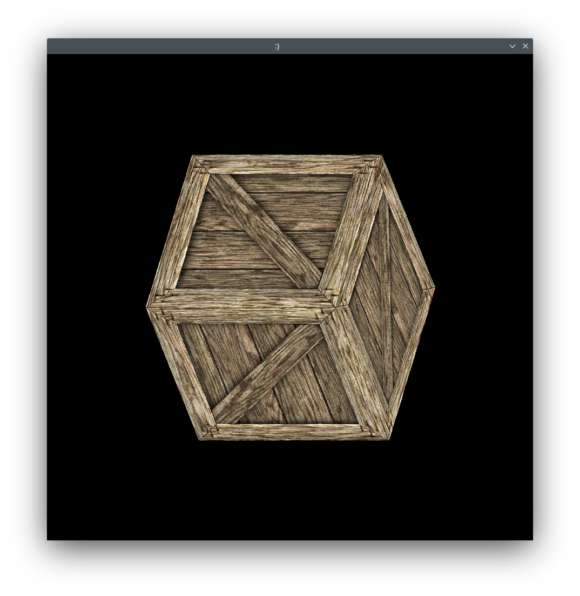

# Rust Software Rendering
An experimental software renderer written in pure Rust.



To run:
```sh
git clone https://github.com/OverShifted/RustSoftwareRendering
cd RustSoftwareRendering
cargo run --release
```

Note: This project depends on [minifb](https://github.com/emoon/rust_minifb). So you might need to install [these libraries](https://github.com/emoon/rust_minifb#build-instructions) on Linux.
